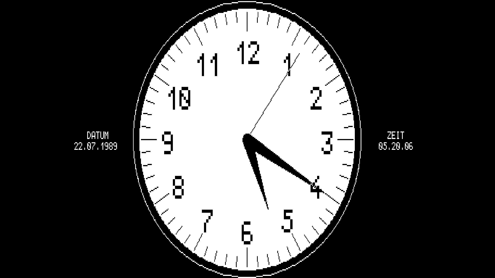



## Emulating the M20 with MAME

--> Proposed update for [M20-Mame on z80ne/m20](http://www.z80ne.com/m20/index.php?argument=sections/tech/mame_m20.inc) <--

Since a while, the Multiple Arcade Machine Emulator [MAME](https://www.mamedev.org/) has a [driver](https://github.com/mamedev/mame/blob/master/src/mame/olivetti/m20.cpp) for the Olivetti L1 M20, enabling MAME to run M20 floppy images, boot PCOS and execute programs, almost like on the original machine [^1]. This article is based on MAME v0.251 on Linux Mint 21 (Jan 11th 2023).

  

Data provided with this article:

| Description | File | Size | CRC |
|:--|:--|--:|--:|
|Olivetti M20 - MAME Romset | m20_roms.zip | xxx | xxx |
|Olivetti M20 - Source code of all BAS games | m20_code.zip | 192370 | 9ee4e53a |

### Running M20 floppy images

After installing MAME, one needs to separately download the M20's ROM contents, e.g. [_m20.zip_](https://wowroms.com/en/roms/mame/olivetti-l1-m20/89051.html). For legal reasons, most ROMs are [not included](https://wiki.mamedev.org/index.php/FAQ:ROMs) in MAME.

Secondly, one needs a floppy to boot from. Floppy disk images of different types can be loaded. Those can be: dd/ sdd/ rdm20 *.img (M20 floppy-sector-dumps), Teledisk *.td0, or ImageDisk *.imd files, as found in the [disk images section](http://www.z80ne.com/m20/index.php?argument=sections/download/wrm20/wrm20.inc). Single images will only work if they have bootable content (e.g. Olivetti's M20 operating system PCOS). A good entry point is _pcos102.img_. 

To get started right away, download ROM data and floppy images into a local directory and from within, run:

    $ mame m20 -rompath . -flop1 <image1> [-flop2 <image2>] [-bios 0] [-cfg_directory ~/.mame/cfg] [-window]

This puts the rom into the virtual M20s right floppy drive (drive 0). Non-PCOS images can additionally be added to the left floppy drive (drive 1) via the "-flop2" argument.

Depending on the ROM file, the following M20 bios versions are supported:
* 1.0 (-bios 0)
* 2.0d (-bios 1)
* 2.0f (-bios 2)

Not all images are running with MAME right away. Some are missing another kind of boot information, which was stored in track0 of the original floppy, but was lost during the [imaging process](http://www.z80ne.com/m20/index.php?argument=sections/transfer/imagereadwrite/imagereadwrite.inc). This is actually the case with most _rdm20/ *.img_ disk images in the disc images section. Unless fixed, these floppies will usually not boot (or boot only partially in MAME), nor work in the second drive.

### The floppy track0 problem

To find out if an image is affected, use e.g. _hexdump_ to see if track0 has been skipped during imaging. Skipping has usually been done on the reading and writing side, so the first bytes of the file would have been filled with zeros. A working image would display bytes different from zero:

    $ hexdump spiele+uhr.img |head -n 1 
    0000000 0000 0000 0000 0000 0000 0000 0000 0000
    $ hexdump pcos102.img |head -n 1
    0000000 0401 2300 1002 0001 0a00 c400 8600 001e

When only dealing with image files in MAME, there is an easy solution. The missing part of track0 does not seem to contain any user data, but information which is written only once while formatting the floppy. It is possible to transfer this track/ information from one image to another. This makes the affected image directly usable with MAME. The file [_pcos102.img_](http://www.z80ne.com/m20/sections/download/wrm20/pcos102.img.bz2) for example has track0 data which can be used. Transferring it to another image using dd:

    $ dd conv=notrunc if=pcos102.img of=spiele+uhr.img bs=4096 count=1

We have successfully fixed _spiele+uhr.img_, which will now boot into PCOS and launch a menu of 19 games and demos!

### Make floppy images writable

MAME supports reading multiple floppy image formats: mfi (MAME floppy image), img (M20 floppy sector dumps, we will also call this format "M20"), imd (Image Disk), td0 (Teledisk). Only some of these images are writable:

| mfi | m20 | imd | td0 |
|:---:|:------------:|:---:|:---:|
| yes | [since v0.212](https://github.com/mamedev/mame/pull/5445) | no | no |

MAME supplies a [tool](https://docs.mamedev.org/tools/floptool.html) for converting between these different formats, with the same limitations for write support. The following will convert an ImageDisk floppy image into a writable M20 sector image:

    $ floptool flopconvert imd m20 floppy1.imd floppy1.img
 
Alternatively, for a bit of PCOS practice, load the image to be converted and an existing image in the target format into the emulator. One of the two images needs to be a system disk in slot0, be able to boot into PCOS, and contain the _vcopy_ tool (see [M20 PCOS and BASIC command reference](http://www.z80ne.com/m20/index.php?argument=sections/manuals/manuals.inc)[^2]). Both images also needs a correct track0 as described above, which is usually the case for the _*.imd_ and _*.td0_ images. Then boot PCOS and copy the source image over to the target image.

On linux:

    $ mame m20 -rompath . -flop1 pcos30e.imd -flop2 copy_pcos102.img

On PCOS, copy flop2 (1:) over flop1 (0:):

    # system
    0> vc 1: 0:

It is also possible to create a completely new image from the MAME in-game menu. However at the time of this writing, this seems only still be possible for _*.mfi_ images.

### Reading and writing BASIC files from images

Files contained in a regular M20-img file can be accessed with [m20floppy](http://www.z80ne.com/m20/index.php?argument=sections/transfer/imagehandle/imagehandle.inc).  Note that BASIC files are usually saved in a compressed/ tokenized binary format. An [interesting](https://github.com/gfis/basdetok) project to learn about the M20-Basic and convert the tokenized version to ASCII is the [M20 Basic Detokenizer](https://github.com/gfis/basdetok/blob/master/src/main/java/org/teherba/basdetok/M20Detokenizer.java)[^3]. Alternatively, one can save files as ASCII via MAME under PCOS BASIC with the "A" option, then extract with m20floppy:

    # SAVE "0:<filename>",A
    $ m20 <image.img> get <filename>

When writing BASIC code in ASCII back to the img, one has to make sure, that the newline delimiter is a single "CR". Linux' "LF" and Windows' "CRLF" would need ro be replaced with e.g. _sed_ or _tr_.

### The anatomy of M20 floppies and MAME images

The original M20 stored data on the physical floppy in two different encodings. Part of the first track has data encoded in FM, while the rest of the floppy was encoded in MFM. PC floppy controllers usually do not understand the FM encoding, so reading of this section was often skipped during imaging.

Even if the whole floppy track can be read, one has to deal with an additional difficulty: FM tracks are 16 sectors * 128 Bytes (= 2048 Bytes) in size, while MFM encoded track size is 16 sectors * 256 Bytes (= 4096 Bytes). To simplify handling of the image file, MAME on the other hand assumes _all_ sectors to be of [equal 256 Byte size](https://github.com/mamedev/mame/blob/master/src/lib/formats/m20_dsk.cpp#L9). 

When reading the original floppy in MFM mode and skipping the first track, this automatically results in the correct 4 KiB offset in the image file. When imaging a real floppy including the FM track, however, one has to pad every single FM sector with another 128 Bytes. Table adapted from[^4]:

|Cylinder.Side| Physical floppy format | Floppy image
|:---|---:|:---:|
|00.0 |FM, 16 Sectors * 128 Bytes| 16 * 256 Bytes|
|00.1 |MFM, 16 Sectors * 256 Bytes | 16 * 256 Bytes|
|01-34.0-1| MFM, 16 Sectors * 256 Bytes | 16 * 256 Bytes|
|(Sum)|284672 Bytes|286720 Bytes|

Instead of extracting from floppy, another option to create a new first track, with PCOS on MAME itself. Booting with a PCOS image in drive0, then create and format a new floppy in drive1:

* Create a new floppy in drive1 via MAME menu:
   File Manager -> flop2 -> [create] -> new.mfi -> Create -> MAME floppy image
* Format the new floppy under PCOS with the command: > vf 1:
* Exit MAME and convert the image from _mfi_ to _m20_ _img_ format using _floptool_
* Investigate the _img_ file using _dd_ and _hexdump_

The resulting image in this example was produced using pcos41a and the first bytes differ slightly from the ones previously obtained from the pcos102 image:

      $ floptool flopconvert mfi m20 new.mfi new.img
      $ dd if=new.img bs=128 skip=0 count=1 |hexdump -v -C |head -n 3
      00000000  04 01 00 23 02 10 01 00  00 10 00 38 00 88 1e 00  |...#.......8....|
      00000010  ff ff 00 00 00 00 00 00  00 01 00 22 00 00 00 22  |..........."..."|
      00000020  ff ff ff ff ff ff ff ff  00 00 00 10 50 43 4f 53  |............PCOS|

Track0 does not contain any user data (see Page 10.2 of the Italian PCOS 1.0 manual) but its content seems to depend on the PCOS version it was created with. For the purpose of using images in MAME, the track does however seem to be completely interchangeable between images. Digging further into the created image, one can notice:

* Mame uses 1s instead of 0s to pad the 128 byte FM sectors. This also happens during conversion using floptool. One has to keep this in mind when attempting to write images back to floppy. You can observe the padding type by increasing the skip parameter in the _dd_-command above (skip uneven sectors).
* Only the first 128 bytes of the image (FM sector 1 of 16) does seem to contain any non-zero information. All other sectors are empty (skip even sectors with _dd_)
* So basically in chunks of 128 Byte, the track would have one section of data (D) then alternating zeros (0) and byte padding (0 or 1).

Two examples showing different padding types, broken down into 16 pairs of 128 bytes, representing the 4 kiB track0 in a MAME compatible sector image:

    D0 00 00 00 00 00 00 00 00 00 00 00 00 00 00 00  - pcos20f.img
    D1 01 01 01 01 01 01 01 01 01 01 01 01 01 01 01  - pcos20h.img (Converted by MAME from *.imd)

MAME seems to be way more forgiving concerning the FM track than the original machine. When writing the images back to floppy one has to be more careful. Ideally the origial FM track should be used, if it is not available one should try to use one from a matching PCOS version. (E.g. the german games/ demo disk does not boot on the original machine with the restored FM track from pcos102, but it does so with an FM track from another pcos20h from e.g. one of the oliword images).

### Compiling MAME from source and running older versions

The latest version of MAME is the github [master branch](https://github.com/mamedev/mame). On Linux just type "make" in the checked out tree. To compile floptool etc. as well, add the "tools" argument. Compiling only the M20 driver is significantly faster and can be done by adding the "subtarget" and "sources" arguments:

    $ make -j8 TOOLS=1 SUBTARGET=m20 SOURCES=olivetti/m20.cpp
    
In order to compile a specific MAME (e.g. v0.212) version we might need to use a different python version:

    $ git clone -b mame0212 --depth 1 https://github.com/mamedev/mame.git mame0212 && cd mame0212
    $ python3.8 -m venv venv38 && source venv38/bin/activate
    $ make -j8 SUBTARGET=m20 SOURCES=src/mame/drivers/m20.cpp
    
I case it does not work, another option is to use [pre-built binaries](https://www.mamedev.org/oldrel.html). They only exist for Windows, but they also run well with wine on Linux.

### Run MSDOS on the M20

On a real M20, with the 8086 addon board, you can boot an Olivetti-MsDos. This also works with MAME, by selecting bios >=1 and the _msdos.img_ floppy image from the disk images section.

    $ mame m20 -bios <1, 2> -rompath . -flop1 msdos.img [-flop2 adm5.imd]

When asked if you want to boot the alternative CPU (8086), press "y" to boot into Dos. The keyboard layout can then be changed with the _setlang_ command, e.g.: `A> setlang german`
Keep in mind, that _msdos.img_ as well as the _adm5*.img_ are MSDOS images of MAME image type "pc". So e.g. _adm5.imd_ can be converted to a writable sector image using:

    $ floptool flopconvert imd pc adm5.imd adm5.img

### Connecting to the M20 serial interface

Run mame with the follwing extra arguments:

    $ mame m20 -rs232 null_modem -bitb socket.127.0.0.1:4321

In PCOS (also see [FAQ](http://www.z80ne.com/m20/index.php?argument=sections/faq/faq.inc), [forum](https://forums.bannister.org/ubbthreads.php?ubb=showflat&Number=101847#Post101847)):

    0> sc com:,9600,,1,8,,on,4096
    0> rs232
    0> +Scom:, +Dcom:

Then connect to the socket with e.g. telnet

    $ telnet 127.0.0.1 4321

We can now type into PCOS from telnet, but PCOS output is not shown in the telnet terminal. I am not sure why. 

### Keyboard and layouts in PCOS and MAME

The keyboard layout depends on the language of the loaded PCOS. The language on PCOS >= 2.0 can be changed with the _sl_-command (see [FAQ](http://www.z80ne.com/m20/index.php?argument=sections/faq/faq.inc)). I could not figure out how to change the language under PCOS1. M20 special keys are usually:

* reset: esc
* hard reset: strg + esc
* yellow/ command: tab 
* blue/ ctrl: left_ctrl
* S1: (German keyboard: #, US keyboard: backslash)
* S2: backspace

Re-defining input keys can be done through the MAME in game menu. The menu can be accessed by first enabling hotkeys, by pressing the "ui_toggle" key and then "tab" to open the menu. The "ui_toggle" is usually set to "ScrollLock" or to "ForwardDelete" on keyboards which lack the former. If you cannot figure out how to toggle hotkeys, you can launch MAME with "-ui_active" and re-define the key: [tab] -> Configure Options -> General Inputs -> User Interface -> UI Toggle. It might makes sense to specify a consistent config directory to save the key mappings, as MAME seems to otherwise use the local working directory:

    $ mame m20 [-ui_active] [-cfg_directory ~/.mame/cfg] [-window]

While you are in the in-game menu, look into other useful options, like recording screenshots (F12) and recording video (LSHIFT + F12).

This little BASIC program can be used to compare different key combinations with the key code tables in the command reference manual:

    0 REM return decimal and hexadecimal values of pressed keys
    10 CLEAR
    20 G$=INKEY$: IF G$="" THEN GOTO 20
    30 PRINT ASC(G$) HEX$(ASC(G$))
    40 GOTO 20

MAME offers an additionally feature to automatically type specified text into the emulated machine with a specified delay after boot. This is useful to e.g. automatically execute programs after start. One has to keep in mind, that _autoboot_ always uses the original "natural" keyboard that the M20 MAME driver was built on, which is the Italian layout. So one has to use an italian pcos (e.g. pcos102.img) or change a pcos >=2.0 to Italian with _slang_ (> sl 0) and save the change to the floppy with _psave_ (> ps). Then the autoboot string will be interpreted correctly. 

The following will boot pcos, switch to BASIC mode and draw a circle:

    $ mame m20 -flop1 pcos102.img -autoboot_delay 15 -autoboot_command 'ba\ncircle(155,123),109\n' -rp . -nomouse -seconds_to_run 60 -skip_gameinfo -window -resolution0 800x600

To work with any given system language one would need access to the emulated keyboard. This is not currently possible via _autoboot_ and seems to be a current limitation of MAME.

### Notes, known issues, open questions, TODOs

* Open questions:
    * How to change the language/ keyboard under pcos1? 
    * Input from telnet to the M20 works, terminal output from the M20 to telnet did not work. Wrong options?

* Issues/ questions at the time of writing (possibly MAME related):
    * Oliword currently causes MAME to hang with 100% cpu load, after entering date and time
    * Creating an new M20 floppy through the MAME menu causes MAME to crash
    * Mame track0 padding '1s vs. 0s' and 'sector vs. track padding': bug or feature? Which is better? Track padding with 0s might be desirable to make it easier when writing images back to floppy.
    * Is printer support possible?
    * What is missing for the "Command+S" boottime easteregg?

* Issues at the time of writing (possibly data related):

    * pcos20f.img: "Not enough memory to boot PCOS"
    * pcos11d.img/ pcos13.img: "Error 53 in files [font.all, kb.all]". The files can be replaced from e.g. pcos-1.3.img.
    * adm51.imd: It seems that this DOS image has been imaged by accidentally skipping track0. Replace it from adm5.
    * startrek_de.img: Based on Italian pcos102, German characters not displayed correctly. Moving the game to a German pcos20 disk solves this, but results in graphics errors and misalignment between text and graphics (settings issue?).

- [ ] Create MAME romset with info on how to fix some images and how to start software
- [ ] Find out how to switch keyboard language in PCOS1 (multiplan_de contains an init.bas for this, but the file is not readable, basdetok?)
- [ ] Images on z80ne: add pcos20h.img, oliword_de.img.bz2 is actually English not German, Oliword only runs with older mame (e.g. 0.212)
- [ ] Update all BAS codes after basdetok is ready
- [ ] Create "official" m20 images (en/it) for two days to race, possible?
- [ ] Remove tech/mfi_images/pcos20_german.zip and games_german.zip MFIs from previous article version
- [ ] Investigate if Oliword_de also has startup error on real M20

[^1]: https://forums.bannister.org/ubbthreads.php?ubb=showflat&Number=78739
[^2]: http://www.z80ne.com/m20/sections/manuals/m20qreff.pdf
[^3]: https://github.com/gfis/basdetok
[^4]: https://jandelgado.github.io/blog/posts/olivetti-m20-disk-preservation/

