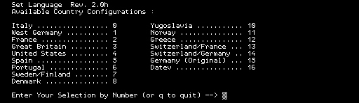

## M20 Supported Keyboard languages 

List of supported keyboard layouts in PCOS 2.0h:

  

When reading an M20 ascii file (e.g. from a floppy) in a unicode environment, the characters depend on the language setting of the PCOS under which the file was originally created with. The following mapping can be used:

| M20 Alternate Graphics | { | \| | } | [ | \\ | ] | ~ | @ |
| :--------------------- | :--- | :--- | :--- | :--- | :--- | :--- | :--- | :--- |
| Italian (0)            | à | ò | è | ° | ç  | é | ì | § |
| West German (1)        | ä | ö | ü | Ä | Ö  | Ü | ß | § |
| French (2)             | é | ù | è | ° | ç  | § | ¨ | à |
| English/ British (3)   | { | \| | } | [ | \\ | ] | ‾ | @ |
| English/ American (4)  | { | \| | } | [ | \\ | ] | ‾ | @ |
| Spanish (5)            | ° | ñ | ç | ¡ | Ñ  | ¿ | ‾ | § |
| Portugese (6)          | ã | ç | õ | Ã | Ç  | Õ | ° | § |
| Swedish Finnish (7)    | ä | ö | å | Ä | Ö  | Å | ‾ | @ |
| Danish (8)             | æ | ø | å | Æ | Ø  | Å | ¨ | ´ |
| Yugoslavian (10)       | đ | ć | ž | Đ | Ć  | Ž | č | Š |
| Norwegian (11)         | æ | ø | å | Æ | Ø  | Å | ¨ | ´ |
| Greek (12)             | { | \| | } | [ | \\ | ] | ‾ | @ |
| French Swiss (13)      | ä | ö | ü | à | ç  | è | é | § |
| German Swiss (14)      | ä | ö | ü | à | ç  | è | é | § |
| Original German (15)   | ä | ö | ü | Ä | Ö  | Ü | ß | § |
| Datev German (16)      | ä | ö | ü | Ä | Ö  | Ü | ß | § |

(The table is WIP and not complete)

Interestingly, two of these characters are part of the BASIC programming language ("\\" is used as integer division, "@" is used as a prefix for call by reference variables). On the original machine, these characters must also be replaced by their corresponding national counterpart. As an example: On the German machine's keyboard, there is no Backslash, in order to perform an integer divisin of e.g. 10\3, one has to write "10Ö3".

- [ ] Figure out more key mappings
