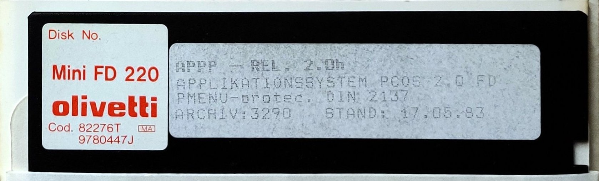


## Reading M20 floppies with modern controllers

--> Working copy of [M20-USB-Floppy on z80ne/m20](http://www.z80ne.com/m20/index.php?argument=sections/transfer/floppy/transfer_floppies.inc) <--

Text based on Greaseweazel 1.8, a Teac FD-55BR drive and Mame v.251, all running on Ubuntu 22.10.

  

When reading M20 floppies under Linux with a standard pc controller (48 tracks per inch, sector size 256 bytes, 16 sectors per track, MFM) one likely has to skip the first 4 kiB/ track0, as many PC controllers cannot read the FM track:

    $ setfdprm /dev/fd1 tpi=48 ssize=256 sect=16 dd ds
    $ sdd -noerror try=5 iseek=4096 oseek=4096 if=/dev/fd1 of=floppy.img bs=256 count=1104 

The first 4 kiB of this image will be zero. More information about setfdprm/ fdutils and the `sdd` tool can be found [here](http://www.z80ne.com/m20/index.php?argument=sections/transfer/imagereadwrite/imagereadwrite.inc). The main reason to use `sdd` over `dd` was the additional seek parameter on the input side.

Other options, using modern USB-floppy-controllers, are also able to read the FM track:

#### Controller options

* [Kryoflux](https://kryoflux.com/):
    - Can not write *.img files back to floppy directly (need to convert to raw flux files first with e.g. the [HxC Floppy Emulator](https://hxc2001.com/download/floppy_drive_emulator/)).
    - Mainly made for reading floppies, writing floppies is possible, but considered a "bonus" and is not officially supported (e.g. if one needs help in the support forums)
    - Reading M20 floppies works and is described e.g. [here](https://jandelgado.github.io/blog/posts/olivetti-m20-disk-preservation/).

* [Greaseweazel v4](https://github.com/keirf/Greaseweazle/wiki):
    - Can [read and write](https://github.com/keirf/greaseweazle/wiki/Supported-Image-Types) IMG and [IMD](https://github.com/keirf/greaseweazle/issues/276) files.
    - Can read and write [mixed](https://github.com/keirf/greaseweazle/issues/143) FM/MFM floppies to sector formats (since v1.6).
    - Supports [FM data padding](https://github.com/keirf/greaseweazle/issues/275) in IMG files ([since v1.8](https://github.com/keirf/greaseweazle/releases/tag/v1.8)), to be compatible with the file size of the original pc-controller approach.

### Greaseweazel setup

Get all necessarzy parts and set up the Greaseweazel v4 according to the [documentation](https://github.com/keirf/greaseweazle/wiki/V4-Setup). 

Now one has to issue only a single command to the `gw`-tool and it will take care of handling the mixed format and padding the lower density FM data all by itself:

    gw read --format="olivetti.m20" floppy.img
    gw write --format="olivetti.m20" floppy.img
    
When reading with a 1.2 MB HD drive one has to pass an additional `--tracks='step=2'` parameter.

This produces an image with the size of 280 kiB. One has to keep in mind that the FM track is only 2 kiB in size, while the MFM tracks are 4 kiB. The total amount of userdata is only 278 kiB. The additional 2 kiB are padding.

It seems to be a de-facto standard to pad the lower density FM data to 4 kiB to achieve a homogeneous track size in the img file. This might be historically motivated. The original method of imaging with a pc controller seeked over the first track in "MFM mode", which automatically created a 4 kiB offset. This resulted in a 280 kiB file.

In order to do the padding while also reading the FM part, one has two options:

- Per track: Pad the entire track0 with an additional 2 kiB (usually used in manual conversion approaches where FM and MFM are read separately and joined by `dd`)
- Per sector: Pad every single FM sector with an additional 128 Bytes ([MAME](http://www.z80ne.com/m20/index.php?argument=sections/tech/mame_m20.inc) and [GW](https://github.com/keirf/greaseweazle/issues/275) use this).

 Alternatively it is also possible to write directly into IMD files, which is a somewhat "smarter" image format, supporting per-sector metadata. Padding is only done in IMG files, since they are plain sector representations of the floppy. Let's look into reading, writing, and padding in more detail (usually one you should not need this):

### Manual config and padding options

To have some more control over how the img file is created from the floppy flux data, one can create a custom `diskdefs.cfg` config for M20 floppies. The following reproduces the original behaviour:

    # Greaseweazel v1.8 diskdefs.cfg for Olivetti M20 360 kB DD floppies
    disk olivetti.m20
        cyls = 35
        heads = 2
        tracks 0.0 ibm.fm
            secs = 16
            bps = 128
            rate = 125
            img_bps = 256
        end
        tracks * ibm.mfm
            secs = 16
            bps = 256
            rate = 250
        end
    end

Then, add the `diskdefs` parameter to the arguemnts:

    gw read --diskdefs diskdefs.cfg --format="olivetti.m20" floppy.img

The `img_bps` parameter in the config file controls the target size of the sectors in the IMG file. By default, gw will attempt to create an equal size of 256 Bytes for all sectors, hence padding every single FM track with another 128 Bytes. 

As a practice example, let's remove the `img_bps` parameter, which will deactivate sector padding. Subsequently we will use manual track padding, to pad the entire FM track to 4 kiB:

#### Reading

Reading the floppy content into an img file without any extra padding (`img_bps` parameter removed):

    gw read --diskdefs diskdefs.cfg --format="olivetti.m20" floppy_unpadded.img
    
This produces an image with the size of 278 kiB. In order to convert the image to the homogeneous the 4 kiB / track sizing, one needs to add an additional 2 kiB of zeros to pad the first track:

    dd if=floppy_unpadded.img of=floppy.img bs=2048 count=1
    dd if=floppy_unpadded.img of=floppy.img bs=2048 skip=1 seek=2

As a sidenote: Mame actually assumes [every one of the 16 sectors](https://github.com/mamedev/mame/blob/mame0251/src/lib/formats/m20_dsk.cpp#L11) in the FM track to be padded with 128 Bytes, instead of padding the entire track0 with an additional 2 kiB (like done here). The resulting track-padded image can however still be loaded into MAME, since only the [very first sector](https://forums.bannister.org/ubbthreads.php?ubb=showflat&Number=100146#Post100146) in the FM track on the floppies seems to contain data anayways. Due to this, the difference between track and sector padding vanishes.

#### Writing

For writing a 280 kiB image back to floppy, one has to reverse the procedure and remove the track padding:

    dd if=floppy.img of=floppy_unpadded.img bs=2048 count=1
    dd if=floppy.img of=floppy_unpadded.img bs=2048 skip=2 seek=1

Then the image can be written with a single command, based on the mixed floppy composition defined in the config:
    
    gw write --diskdefs diskdefs.cfg --format="olivetti.m20" floppy_unpadded.img
    
Another MAME sidenote: While we use 0s for the padding, MAME seems to use 1s to pad the sectors. If the image has previously been created/ converted in MAME one can investigate the original image e.g. with dd and hexdump. By increasing the skip parameter to odd numbers one can skip to the padding data:

    dd if=floppy.img bs=128 skip=1 count=1 |hexdump -v -C

When writing back the first 2 kiB of such a mame-created image file, one would write some of the non-zero sector-padding data back to the disk, which does not technically belong there. Assuming again that for the M20 only the first sector contains data, the conversion can also be done by only copying the first sector to the image, and then skipping the rest of the first track:

    dd if=floppy_mame.img of=floppy.img bs=128 count=1
    dd if=floppy_mame.img of=floppy.img bs=4096 skip=1 seek=1
    
None of the known (non-dos) images contain any data other than in the first sector/ first 128 bytes, so the method should be safe to use, but better double check.

Note: In any case, an M20 image created/ converted by MAME, will end up having a different checksum once it has been written to floppy and read back. This is simply because the padding data is different.

### Drive

Should be a 360kB 40 track drive. Options include:

* Teac FD-55BR: [vogons](https://vogonswiki.com/index.php/Teac_FD-55BR) or [retrocmp](https://retrocmp.de/fdd/teac/fd55_i.htm)
* Tandon TM100-2A: [retrocmp](https://retrocmp.de/fdd/tandon/tm100-2a.htm)

The newer 1.2 MB, 80 track HD drives are able to read the M20 35 track floppies, but might not write them well, due to narrower track size. 

### Media

* Use 5+1⁄4-inch DD 360 kB floppies.
* Possible to use 720 kB QD? They are supported by the M20 natively, but I have never seen such a floppy.
* Possible to use 1.2M HD? According to [this article](https://forum.vcfed.org/index.php?threads/1-2mb-floppy-in-360kb-drive.52905/) it might be possible to re-format this media for DD for use in the M20.

### Reading and writing BASIC codes

An IMG disk image can now be explored with the [m20floppy](http://www.z80ne.com/m20/index.php?argument=sections/transfer/imagehandle/imagehandle.inc) tool. When extracting BASIC codes from the floppy image, it is usually obtained in a "tokenized" form (unless saved with SAVE,A under pcos). In order to decypher the BASIC codes, one can use the "Basic De-Tokenizer for M20 - [Basdetok](https://github.com/gfis/basdetok)", to tranlate into ASCII. After conversion, the files can be modified on the host machine. The files can also be written back to the image file in ASCII format, given that there is enough space left on the floppy. When writing back, one needs to make sure that line breaks are single "CR". A helpful script to compile basdetok can be found [here](https://github.com/eberhab/m20/blob/master/scripts/install_basdetok.sh).

The character set for the M20 was country dependent. A (incomplete) list to translate some of the obtained characters can be found [here](https://github.com/eberhab/m20/blob/master/keyboard_languages.md) or [here](https://github.com/eberhab/m20/blob/master/scripts/keyb_mapping_rules_sed.txt) as sed rules.

Example for reading a basic file from an IMG originally created with a West German charset:

    m20 floppy.img get program 
    basdetok -m20 program |tr "\r" "\n" |sed '{s/{/ä/g;s/|/ö/g;s/}/ü/g;s/\[/Ä/g;s/\\/Ö/g;s/]/Ü/g;s/~/ß/g;s/@/§/g}' > program.bas 

Now `program.bas` can be edited and written back to the image:

    cat program.bas |tr "\n" "\r" |tr -d "\n" | sed '{s/ä/{/g;s/ö/|/g;s/ü/}/g;s/Ä/\[/g;s/Ö/\\/g;s/Ü/]/g;s/ß/~/g;s/§/@/g}' > program 
    m20 floppy.img put program
    
Then write the image back to floppy or run with [MAME](http://www.z80ne.com/m20/index.php?argument=sections/tech/mame_m20.inc).

## Using floppy images directly on the M20

An alternative to reading original floppies with a USB controller, would be to use a modern drive emulator directly on the M20. One option, the counterpart to the Greaseweazle if you will, would be the [Gotek floppy driver emulator](https://amigastore.eu/en/403-usb-floppy-emulator-gotek-black-version.html#/) with [FlashFloppy firmware](https://github.com/keirf/flashfloppy). This setup would enable the M20 to use *img floppy images directly from a usb stick. 

In order the connect the Gotek (or any other 320k PC drive), one has to make sure to disconnect the additional 12V power line from the M20. The M20 power connectors serve (5V, G, 12V, 12V) while the PC connectors expect (5V, G, G, 12V). So the additional 12V line needs to be removed. Avoid using the twist in the floppy cable for drive numbering, it does not seem to work on the M20, so both drives have to be connected to the un-twisted part of the data cable. Like the original M20 drives, also the Goteks have jumpers to define the drive number. In order to number the drives, these jumpers should be used. 

The Flashfloppy Gotek firmware also supports track padding as "img_bps" since v3.39. The following config can be used to directly load MAME images:

    [::286720]
    file-layout = interleaved
    cyls = 35
    heads = 2
    interleave = 1
    secs = 16
    id=1
    tracks = 0.0 ## Boot cylinder, head 0
        bps = 128 ## Cylinder 0, head 0 has 128-byte sectors
        mode = fm
        img_bps = 256
    tracks = 0.1 ## Boot cylinder, head 1
        bps = 256 ## Cylinder 0, head 1 has 256-byte sectors
        mode = mfm
    tracks = 1-34 ## All other cylinders
        bps = 256
        mode = mfm

This could be an alternative route, if the movable components in the floppy drive have degraded and [repairing it](http://www.z80ne.com/m20/index.php?argument=sections/repair/drives/drives.inc) is not possible.

